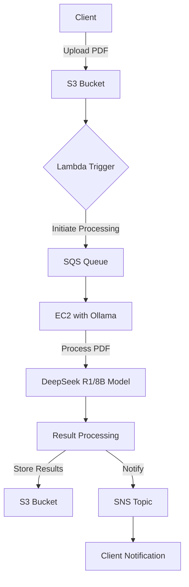

# System Patterns: AWS-based Large PDF Processing System

## Architecture Overview
Our system leverages AWS cloud architecture, Ollama for model management and inference, and a robust PDF processing pipeline to efficiently handle large document volumes.

## Key Components

### 1. EC2 Instances
- Purpose: Host Ollama and LLM models
- Configuration: GPU-optimized instances for efficient model inference
- Scalability: Auto Scaling groups to handle varying loads

### 2. S3 (Simple Storage Service)
- Purpose: Store input PDFs and processed results
- Configuration: Versioning enabled for data integrity
- Security: Server-side encryption for data at rest

### 3. Lambda Functions
- Purpose: Orchestrate workflow and trigger processing tasks
- Implementation: Python-based functions for flexibility and ease of development
- Integration: Tight coupling with S3 events and SQS for efficient processing

### 4. SQS (Simple Queue Service)
- Purpose: Manage processing jobs and ensure scalability
- Configuration: FIFO queues for maintaining processing order when necessary
- Retry Logic: Implement dead-letter queues for handling processing failures

### 5. CloudWatch
- Purpose: Monitoring and logging
- Implementation: Custom metrics for tracking processing times and success rates
- Alerts: Set up alarms for abnormal system behavior or performance issues

## Data Flow

1. PDF Upload
   - Client uploads PDF to designated S3 bucket
   - S3 event triggers Lambda function

2. Job Queue
   - Lambda function creates a processing job and sends it to SQS
   - Job includes reference to PDF location and processing parameters

3. PDF Processing
   - EC2 instances running Ollama poll SQS for new jobs
   - When a job is received, the instance downloads the PDF from S3

4. LLM Processing
   - PDF text is extracted and sent to DeepSeek R1/8B model via Ollama
   - Model performs required analysis (e.g., summarization, entity extraction)

5. Result Storage
   - Processed results are stored back in S3
   - Original PDF and results are linked for easy retrieval

6. Client Notification
   - SNS topic is used to notify the client of completed processing
   - Notification includes link to results in S3

## Scalability Considerations
- Utilize EC2 Auto Scaling groups to dynamically adjust processing capacity
- Implement SQS to decouple PDF upload from processing, allowing for smooth handling of traffic spikes
- Use S3 Transfer Acceleration for faster uploads of large PDFs from distant locations

## Security Patterns
- Implement VPC for network isolation of EC2 instances
- Use IAM roles for secure, key-less authentication between AWS services
- Enable encryption in transit (HTTPS) and at rest (S3 encryption) for all data

## Monitoring and Logging Patterns
- Centralize logs using CloudWatch Logs
- Set up CloudWatch Dashboards for real-time system overview
- Implement custom metrics for tracking PDF processing times and success rates

This system architecture and these patterns provide a scalable, secure, and efficient foundation for our AWS-based Large PDF Processing System, with clear pathways for future enhancements and optimizations.
