# System Patterns: AI-Powered PDF Processing System for Healthcare

## Architecture Overview
Our system evolves through three phases: an initial MVP (Deepseek RAG App) hosted on AWS, an extended MVP for hospital secretaries with local deployment, and a scalable AWS-based solution for handling large document volumes across multiple industries.

```mermaid
graph TD
    subgraph "Initial MVP (Deepseek RAG App)"
    A[User] -->|Upload PDF| B[EC2 Instance]
    B --> C[Nginx Reverse Proxy]
    C --> D[Streamlit App]
    D -->|Process PDF| E[Ollama]
    E -->|LLM Processing| F[DeepSeek R1/8B Model]
    F --> G[Result Processing]
    G -->|Display| H[User Interface]
    end

    subgraph "Extended MVP (Local Deployment)"
    I[Hospital Secretary] -->|Upload PDF| J[Local Storage]
    J --> K[Local Processing Application]
    K -->|Process PDF| L[Local LLM]
    L --> M[Result Processing]
    M -->|Store Results| N[Local Storage]
    M -->|Display| O[User Interface]
    end

    subgraph "Scaled Solution (AWS)"
    P[Client] -->|Upload PDF| Q[S3 Bucket]
    Q --> R{Lambda Trigger}
    R -->|Initiate Processing| S[SQS Queue]
    S --> T[EC2 with Ollama]
    T -->|Process PDF| U[DeepSeek R1/8B Model]
    U --> V[Result Processing]
    V -->|Store Results| W[S3 Bucket]
    V -->|Notify| X[SNS Topic]
    X --> Y[Client Notification]
    end
```

## Key Components

### Initial MVP Phase (Deepseek RAG App)

1. EC2 Instance (G6.xlarge)
   - Purpose: Host the entire application stack
   - Configuration: GPU-enabled for efficient LLM processing
   - OS: Ubuntu 22.04 LTS

2. Nginx Reverse Proxy
   - Purpose: Route traffic and provide HTTPS security
   - Configuration: Proxy requests to Streamlit app and Ollama API

3. Streamlit Application
   - Purpose: Provide user interface for PDF upload and interaction
   - Implementation: Python-based web application

4. Ollama
   - Purpose: Manage and run the LLM model
   - Integration: Tightly coupled with the Streamlit application

5. DeepSeek R1/8B Model
   - Purpose: Perform document analysis and question answering
   - Configuration: Optimized for running on GPU-enabled EC2 instance

### Extended MVP Phase

1. Local Processing Application
   - Purpose: Handle PDF upload, processing, and result display
   - Implementation: Desktop application with user-friendly interface
   - Security: Implement local encryption and access controls

2. Local LLM
   - Purpose: Perform document analysis and information extraction
   - Configuration: Optimized for running on a standard PC
   - Integration: Tightly coupled with the local processing application

3. Local Storage
   - Purpose: Store input PDFs and processed results
   - Security: Implement encryption and secure access mechanisms
   - Organization: Maintain clear structure for easy retrieval and backup

### Scaled Solution Phase

1. EC2 Instances
   - Purpose: Host Ollama and LLM models
   - Configuration: GPU-optimized instances for efficient model inference
   - Scalability: Auto Scaling groups to handle varying loads

2. S3 (Simple Storage Service)
   - Purpose: Store input PDFs and processed results
   - Configuration: Versioning enabled for data integrity
   - Security: Server-side encryption for data at rest

3. Lambda Functions
   - Purpose: Orchestrate workflow and trigger processing tasks
   - Implementation: Python-based functions for flexibility and ease of development
   - Integration: Tight coupling with S3 events and SQS for efficient processing

4. SQS (Simple Queue Service)
   - Purpose: Manage processing jobs and ensure scalability
   - Configuration: FIFO queues for maintaining processing order when necessary
   - Retry Logic: Implement dead-letter queues for handling processing failures

5. CloudWatch
   - Purpose: Monitoring and logging
   - Implementation: Custom metrics for tracking processing times and success rates
   - Alerts: Set up alarms for abnormal system behavior or performance issues

## Data Flow

### Initial MVP Phase (Deepseek RAG App)

1. PDF Upload
   - User uploads 80-page PDF through the Streamlit web interface
   - PDF is temporarily stored on the EC2 instance

2. PDF Processing
   - Streamlit app triggers the processing pipeline
   - PDF text is extracted and sent to Ollama for LLM processing

3. Question Answering
   - User asks questions about the PDF content
   - Queries are sent to the DeepSeek R1/8B model via Ollama
   - Model generates responses based on the PDF content

4. Result Display
   - Answers are displayed in the Streamlit interface for the user to review

### Extended MVP Phase

1. PDF Upload
   - Hospital secretary uploads PDF through the local application interface
   - PDF is stored in a designated local directory

2. PDF Processing
   - Local application triggers the processing pipeline
   - PDF text is extracted and sent to the local LLM for analysis

3. Result Storage and Display
   - Processed results are stored locally
   - Results are displayed in the application interface for the secretary to review

### Scaled Solution Phase

1. PDF Upload
   - Client uploads PDF to designated S3 bucket
   - S3 event triggers Lambda function

2. Job Queue
   - Lambda function creates a processing job and sends it to SQS
   - Job includes reference to PDF location and processing parameters

3. PDF Processing
   - EC2 instances running Ollama poll SQS for new jobs
   - When a job is received, the instance downloads the PDF from S3

4. LLM Processing
   - PDF text is extracted and sent to DeepSeek R1/8B model via Ollama
   - Model performs required analysis (e.g., summarization, entity extraction)

5. Result Storage
   - Processed results are stored back in S3
   - Original PDF and results are linked for easy retrieval

6. Client Notification
   - SNS topic is used to notify the client of completed processing
   - Notification includes link to results in S3

## Scalability Considerations
- Design initial MVP for single-user performance, focusing on efficient processing of 80-page PDFs
- Plan for transition from EC2-hosted MVP to local deployment for extended MVP
- Utilize EC2 Auto Scaling groups in scaled solution phase to dynamically adjust processing capacity
- Implement SQS in scaled solution phase to decouple PDF upload from processing, allowing for smooth handling of traffic spikes

## Security Patterns
- Implement HTTPS using SSL/TLS certificates for the initial MVP
- Use IAM roles for secure, key-less authentication between AWS services
- Implement strong local security measures in extended MVP phase, including data encryption and access controls
- In scaled solution phase, implement VPC for network isolation of EC2 instances
- Enable encryption in transit (HTTPS) and at rest (S3 encryption) for all data in AWS phases
- Ensure compliance with Swiss data protection laws (including FADP) in all phases, with particular focus on the extended MVP for healthcare use

## Monitoring and Logging Patterns
- Implement basic logging and performance monitoring for the initial MVP using EC2 instance logs
- Develop more comprehensive local logging for the extended MVP phase
- In scaled solution phase, centralize logs using CloudWatch Logs
- Set up CloudWatch Dashboards for real-time system overview in AWS phases
- Implement custom metrics for tracking PDF processing times and success rates in all phases

This system architecture and these patterns provide a scalable, secure, and efficient foundation for our AI-Powered PDF Processing System, starting with a focused AWS-hosted MVP, progressing through a locally deployed solution for healthcare, and evolving into a comprehensive AWS-based solution for multiple industries.
